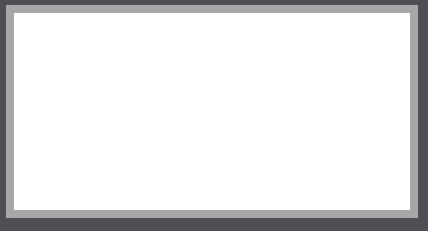
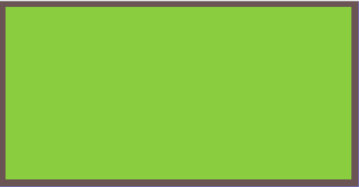
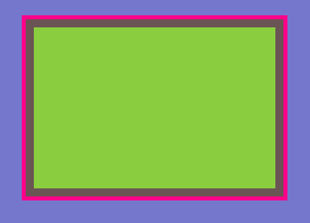
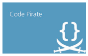
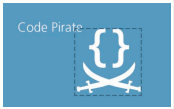
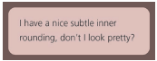
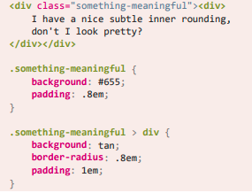

```html
<!DOCTYPE html>
<html lang="en">
<head>
    <meta charset="UTF-8">
    <meta http-equiv="X-UA-Compatible" content="IE=edge">
    <meta name="viewport" content="width=device-width, initial-scale=1.0">
    <title>Document</title>
    <style>
        body {
            background: rgb(78, 78, 85);
        }
        #pic{
            width: 300px;
            height: 200px;
            position: absolute;
            top: 100px;
            left: 100px;
        }
    </style>
</head>
<body>
    <div id="pic"></div>
</body>
</html>
```

# 一、半透明边框

* 假设给一个容器设置一层白色背景和一道半透明的边框。body的背景会从它的半透明边框透上来。

* 该代码会得到以下效果：

```css
#pic{
    width: 500px;
    height: 250px;
    border: 10px solid hsla(0,0%,100%,.5);
    background: white;
    background-clip: padding-box;
}
```



* 通过background-clip属性来指定背景绘制区域。
    * background-clip属性默认值为border-box：背景绘制在边框方框内。
    * padding-box：将背景绘制在衬距方框内。

# 二、多重边框

## 1、box-shadow方案

* **利用box-shadow的第四个参数指定正值或负值来让投影面积加大或减小**。

```css
#pic{
    background: yellowgreen;
    box-shadow: 0 0 0 10px #655;
}
```


* **box-shadow支持逗号分隔语法，可以创建任意数量的投影。**
* box-shadow 是层层叠加的，第一层投影位于最顶层，依次类推。

```css
#pic{
    background: yellowgreen;
    box-shadow: 0 0 0 10px #655, 0 0 0 15px deeppink;
}
```



## 2、outline方案

* 用于设置两层边框：先设置一层常规边框，再加上outline属性来产生外层的边框。
* **优点：在于边框样式十分灵活，不像box-shadow方案只能模拟实线边框。**
* 以下代码也可以实现上图效果。

```css
#pic{
    background: yellowgreen;
    border: 10px solid #655;
    outline: 5px solid deeppink;
}
```

# 三、灵活的背景定位

* **难题：**
    * 针对某个角对背景图片做偏移定位。
    * 在CSS 2.1中，我们只能指定距离左上角的偏移量，或者干脆完全靠齐到其他三个角。如下图：



## 1、background-position的扩展语法方案

* **background-position属性得到扩展：**
    * **允许我们指定背景图片距离任意角的偏移量**；
    * **只需要在偏移量前面指定关键字**。

```css
#pic{
    background: url(code-pirate.svg) no-repeat #58a;
    background-position: right 20px bottom 10px;
}
```



* 在不支持background-position扩展语法的浏览器中，背景图片会紧贴在左上角（背景图片的默认位置）。
* 提供一个回退方案也很简单，就是把老套的bottom right 定位值写进 background 的简写属性中

```css
#pic{
    background: url(code-pirate.svg)
                no-repeat bottom right #58a;
    background-position: right 20px bottom 10px;
}
```

* 默认情况下，background-position是以padding box为准，这样边框才不会遮住背景图片。

## 2、background-origin方案

* background-origin默认情况下，它的值是padding-box。
* 如果把它的值改成 content-box ，我们在 background-position 属性中使用的边角关键字将会以内容区的边缘作为基准。

```css
#pic{
    background: url(code-pirate.svg)
                no-repeat bottom right #58a;
    background-position: right 20px bottom 10px;
}
```

* 视觉效果同上。

## 3、calc()方案

* 如果我们仍然以左上角偏移的思路来考虑，其实就是希望它有一个 100% - 20px 的水平偏移量，以及 100% - 10px 的垂直偏移量。
* calc()函数允许我们执行此类运算，它可以完美地在background-position 属性中使用。

```css
#pic{
    background: url("code-pirate.svg") no-repeat;
    background-position: calc(100% - 20px) calc(100% - 10px);
}
```

# 四、边框内圆角

* 有时我们需要一个容器，**只在内侧有圆角，而边框或描边的四个角在外部仍然保持直角的形状**，如图下所示。这是一个有趣的效果，目前还没有被滥用。



* 用两个元素可以实现这个效果，这并没有什么特别的。


