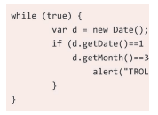
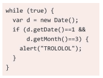
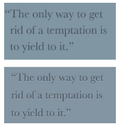
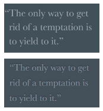
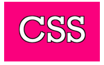

# 二十三、调整tab的宽度

## 问题提出

* 由于tab导致文本间间隙过大进而影响视觉效果。

## 解决方案

* tab-size属性：
    * 接受一个数字（表示字符数）或者一个长度值。
    * 通常希望把它设置为 4（表示 4 个字符的宽度）或2。
```css
pre {
    tab-size: 2;
}
```
* 视觉效果对比：




# 二十四、连字

## 问题提出

* 由于字形间的相互影响，导致字形模糊不清。

## 解决方案

* font-variant-ligatures属性：
    * 该属性专门用来控制连字效果的开启和关闭。
    * 如果要启用所有可能的连字，需要同时指定这三个标识符。
    * 如果要把 font-variant-ligatures 属性复位为初始值，应该使用 normal 而不是 none。

```css
div{
    font-variant-ligatures: common-ligatures
        discretionary-ligatures
        historical-ligatures;
}
```

# 二十五、华丽的&符号

* 通过@font-face规则实现基本的字体嵌入。

* 无法通过单一的字符实现不同样式的&。

## 解决方案

* 原理：如果某款字体可用，但仅包括某几个字符，那它就只会用来显示这几个字符；而在显示其他字符时，浏览器就会回退到其他字体。
* 方法：创建一种只包含 & 字形的 Web 字体，通过 @font-face 将其引入网页，然后把它排在字体队列中的第一位。
    * @font-face 规则中的 src 描述符还可以接受 local()函数，用于指定本地字体的名称。

```css
@font-face {
    font-family: Ampersand;
    src: local('Baskerville-Italic'),
    local('GoudyOldStyleT-Italic'),
    local('Palatino-Italic'),
    local('BookAntiqua-Italic');
    unicode-range: U+26;
}
h1 {
    font-family: Ampersand, Helvetica, sans-serif;
}
```

# 二十六、自定义下划线

## 知识点

* CSS 渐变；
* background-size；
* text-shadow；
* “条纹背景”。

## 问题提出

* 默认样式往往太过扎眼，更不要提在不同浏览器下的渲染效果大相径庭。

## 解决方案

```css
h1 {
    background: linear-gradient(gray, gray) no-repeat;
    background-size: 100% 1px;
    background-position: 0 1.15em;
    text-shadow: .05em 0 white, -.05em 0 white;
}
```

* 通过渐变和background-size两个属性来产生灰色细线，然后使用background-position调整位置。
* 由于这样产生的下划线会穿过某些字母（比如 p 和 y）的降部。所以此时设置两层与背景色相同的 text-shadow 来模拟下划线在遇到字母时会自动断开避让这种效果。
* 生成一条虚线下划线：

```css
h1 {
    background: linear-gradient(90deg,gray 66%, transparent 0) repeat-x;
    background-size: .2em 2px;
    background-position: 0 1em;
}
```

# 二十七、现实中的文字效果

## 凸版印刷效果

* **当我们在浅色背景上使用深色文字时（比如眼前的这个例子），在底部加上浅色投影通常效果最佳。**
* **如果把文字和背景的颜色深度对调，在这种情况下，给文字顶部加深色投影是最佳方案。**

```css
p {
    background: hsl(210, 13%, 60%);
    color: hsl(210, 13%, 30%);
    text-shadow: 0 1px 1px hsla(0,0%,100%,.8);
}
```



```css
p {
    background: hsl(210, 13%, 40%);
    color: hsl(210, 13%, 75%);
    text-shadow: 0 -1px 1px black;
}
```



## 空心字效果

* 使用 text-shadows 属性的扩张参数就可让投影变大，看起来就像给文字勾边了一样。
* 方法一：使用多个 text-shadow 分别为这些投影加上不同方向的少量偏移。

```css
p {
    background: deeppink;
    color: white;
    text-shadow: 1px 1px black, -1px -1px black,
                1px -1px black, -1px 1px black;
}
```



* 方法二：重叠多层轻微模糊的投影来模拟描边。

```css
p {
    background: deeppink;
    color: white;
    text-shadow: 0 0 1px black, 0 0 1px black,
                0 0 1px black, 0 0 1px black,
                0 0 1px black, 0 0 1px black;
}
```

## 文字外发光效果

* **方法一**：只需要准备几层重叠的 text-shadow 即可，不需要考虑偏移量，颜色也只需跟文字保持一致。

```css
p {
    background: #203;
    color: #ffc;
    text-shadow: 0 0 .1em, 0 0 .3em;
}
```


* 依赖 text-shadow 来实现文字显示的做法无法实现平稳退化：如果浏览器不支持 text-shadow，那就什么字也看不见了。
* **方法二**：使用 CSS 滤镜来实现文字的模糊效果

```css
a {
    background: #203;
    color: white;
    transition: 1s;
} 
a:hover {
    filter: blur(.1em); 
}
```

## 文字突起效果

* **思路**：使用一长串累加的投影，不设模糊并以 1px 的跨度逐渐错开，使颜色逐渐变暗，然后在底部加一层强烈模糊的暗投影，从而模拟完整的立体效果。

```css
div{
    background: #58a;
    color: white;
    text-shadow: 0 1px hsl(0,0%,85%),
                0 2px hsl(0,0%,80%),
                0 3px hsl(0,0%,75%),
                0 4px hsl(0,0%,70%),
                0 5px hsl(0,0%,65%),
                0 5px 10px black;
}
```


# 二十八、环形文字

* 使用svg解决。