# 五、条纹背景

## 难题

* 不论是在网页设计中，还是在其他传统媒介中（比如杂志和墙纸等），各种尺寸、颜色、角度的条纹图案在视觉设计中无处不在。
* 要想在网页中实现条纹图案，其过程还远远不够理想。通常，我们的方法是创建一个单独的位图文件，然后每次需要做些调整时，都用图像编辑器来修改它。
* 可能有人试过用 SVG 来取代位图，但这样还是会有一个独立的文件，而且它的语法也远远不够友好。
* 如果可以直接在 CSS 中创建条纹图案，那该有多棒啊！你可能会惊讶地发现，我们居然真的可以。

## 解决方案

* 假设我们有一条基本的垂直线性渐变，颜色从 #fb3 过渡到 #58a。

```css
div{
    background: linear-gradient(#fb3, #58a);
}
```

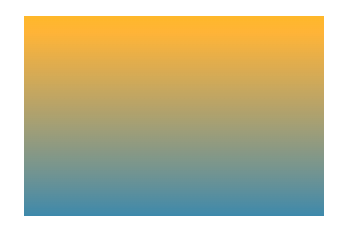

* 现在，让我们试着把这两个色标拉近一点。

```css
div{
    background: linear-gradient(#fb3 20%, #58a 80%);
}
```
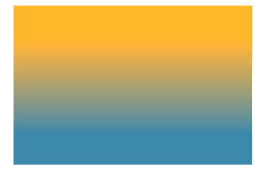

* 现在容器顶部的 20% 区域被填充为 #fb3 实色，而底部 20% 区域被填充为 #58a 实色。**真正的渐变只出现在容器 60% 的高度区域**。
* 如果我们把两个色标继续拉近（分别改为 40% 和 60%），那真正的渐变区域就变得更窄了。
* **如果多个色标具有相同的位置，它们会产生一个无限小的过渡区域，过渡的起止色分别是第一个和最后一个指定值。**从效果上看，颜色会在那个位置突然变化，而不是一个平滑的渐变过程。

```css
div{
    background: linear-gradient(#fb3 50%, #58a 50%);
}
```

* **因为渐变是一种由代码生成的图像，我们能像对待其他任何背景图像那样对待它，而且还可以通过 background-size 来调整其尺寸。**

```css
div{
    background: linear-gradient(#fb3 50%, #58a 50%);
    background-size: 100% 30px;
}
```

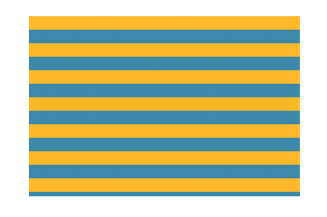

* 我们还可以用相同的方法来创建不等宽的条纹，只需调整色标的位置值即可。

```css
div{
    background: linear-gradient(#fb3 30%, #58a 30%);
    background-size: 100% 30px;
}
```

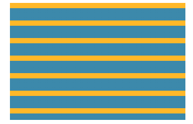

* 为了避免每次改动条纹宽度时都要修改两个数字，我们可以再次从规范那里找到捷径。
    * **如果某个色标的位置值比整个列表中在它之前的色标的位置值都要小，则该色标的位置值会被设置为它前面所有色标位置值的最大值**。

```css
div{
    background: linear-gradient(#fb3 30%, #58a 0);
    background-size: 100% 30px;
}
```

* 如果要创建超过两种颜色的条纹，也是很容易的。

```css
div{
    background: linear-gradient(#fb3 33.3%,#58a 0, #58a 66.6%, yellowgreen 0);
    background-size: 100% 45px;
}
```

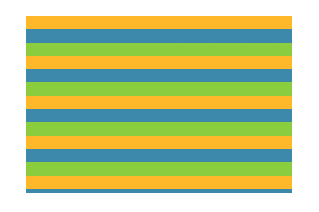

## 垂直条纹

* 垂直条纹的代码跟水平条纹几乎是一样的，差别主要在于：**我们需要在开头加上一个额外的参数来指定渐变的方向。**
* 在水平条纹的代码中，我们其实也可以加上这个参数，只不过它的默认值 to bottom 本来就跟我们的意图一致，于是就省略了。
* 最后，我们还需要把 background-size 的值颠倒一下。

```css
div{
    background: linear-gradient(to right, /* 或 90deg */#fb3 50%, #58a 0);
    background-size: 30px 100%;
}
```

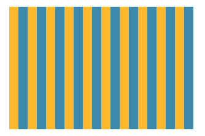

## 斜向条纹

* 如果我们再次改变 background-size 的值和渐变的方向，是不是就可以得到斜向（比如45°）的条纹图案。

```css
div{
    background: linear-gradient(45deg,#fb3 50%, #58a 0);
    background-size: 30px 30px;
}
```

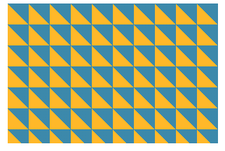

* 这个办法行不通。原因在于我们**只是把每个“贴片”内部的渐变旋转了 45°，而不是把整个重复的背景都旋转了**。
* 单个贴片包含了四条条纹，而不是两条，只有这样才有可能做到无缝拼接它正是我们需要在 CSS 代码中重新实现的贴片，因此我们需要增加一些色标。

```css
div{
    background: linear-gradient(45deg,
                #fb3 25%, #58a 0, #58a 50%,
                #fb3 0, #fb3 75%, #58a 0);
    background-size: 30px 30px;
}
```

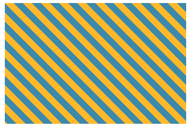

## 更好的斜向条纹

* 设置任意角度倾斜：
    * repeating-gradient()和repeating-radial-gradient()方法。
    * **色标是无限循环重复的，直到填满整个背景**。

```css
div{
    background: repeating-linear-gradient(45deg,#fb3, #58a 30px);
}
```

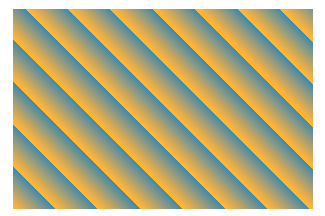

* 将斜向45°条纹修改为60°。

```css
div{
    background: repeating-linear-gradient(60deg,#fb3, #fb3 15px, #58a 0, #58a 30px);
}
```

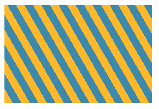

## 灵活的同色系条纹

* 不再为每种条纹单独指定颜色，而是把最深的颜色指定为背景色，同时把半透明白色的条纹叠加在背景色之上来得到浅色条纹。

```css
div{
    background: #58a;
    background-image: repeating-linear-gradient(30deg,
                    hsla(0,0%,100%,.1),
                    hsla(0,0%,100%,.1) 15px,
                    transparent 0, transparent 30px);
}
```

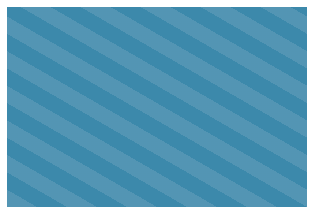
