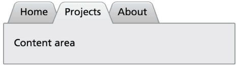
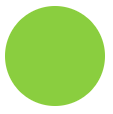
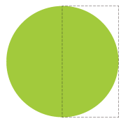

# 十三、梯形标签页

* 在 CSS 中用 3D 旋转来模拟出这个效果。

```css
div{
    transform: perspective(.5em) rotateX(5deg);
}
```

* 对元素使用了 3D 变形之后，其内部的变形效应是“不可逆转”的。
* 所以唯一可行的途径就是把变形效果作用在伪元素上。

```css
.tab {
    position: relative;
    display: inline-block;
    padding: .5em 1em .35em;
    color: white;
}
.tab::before {
    content: ''; /* 用伪元素来生成一个矩形 */
    position: absolute;
    top: 0; right: 0; bottom: 0; left: 0;
    z-index: -1;
    background: #58a;
    transform: scaleY(1.3) perspective(.5em)
                rotateX(5deg);
    transform-origin: bottom;
}
```

* 下面这段代码会给标签页添加图中的那些样式。

```css
nav > a {
    position: relative;
    display: inline-block;
    padding: .3em 1em 0;
}
nav > a::before {
    content: '';
    position: absolute;
    top: 0; right: 0; bottom: 0; left: 0;
    z-index: -1;
    background: #ccc;
    background-image: linear-gradient(
                        hsla(0,0%,100%,.6),
                        hsla(0,0%,100%,0));
    border: 1px solid rgba(0,0,0,.4);
    border-bottom: none;
    border-radius: .5em .5em 0 0;
    box-shadow: 0 .15em white inset;
    transform: perspective(.5em) rotateX(5deg);
    transform-origin: bottom;
}
```



# 十四、简单的饼图

## 基于transform的解决方案

```html
<div class="pie"></div>
```

```css
.pie {
    width: 100px; height: 100px;
    border-radius: 50%;
    background: yellowgreen;
}
```



* **把圆形的左右两部分指定为上述两种颜色，然后用伪元素覆盖上去，通过旋转来决定露出多大的扇区。**

```css
.pie {
    width: 100px; height: 100px;
    border-radius: 50%;
    background: yellowgreen;
    background-image:
        linear-gradient(to right, transparent 50%, #655 0);
}
.pie::before {
    content: '';
    display: block;
    margin-left: 50%;
    height: 100%;
}
```

* 伪元素现在相对于整个饼图进行了重叠。不过现在还没有设置任何样式，它还起不到遮盖的作用：暂时只是一个透明的矩形。在开始为它设置样式之前，我们还要再做一些观察和分析。
    * 我们希望它能遮盖圆形中的棕色部分，**因此应该给它指定绿色背景**。在这里使用 background-color: inherit 声明可以避免代码的重复，因为我们希望它的背景色与其宿主元素保持一致。
    * 我们希望它是绕着圆形的圆心来旋转的，对它自己来说，这个点就是它左边缘的中心点。因此，我们应该把它的 transform-origin 设置为 0 50%，或者干脆写成 left。
    * 我们不希望它呈现出矩形的形状，否则它会突破整个饼图的圆形范围。因此要么给 .pie 设置 overflow: hidden 的样式，要么给这个伪元素指定合适的 border-radius 属性来把它变成一个半圆。

```css
.pie {
    width: 100px; height: 100px;
    border-radius: 50%;
    background: yellowgreen;
    overflow: hidden;
    background-image:
        linear-gradient(to right, transparent 50%, #655 0);
}
.pie::before {
    content: '';
    display: block;
    margin-left: 50%;
    height: 100%;
    border-radius: 0 100% 100% 0 / 50%;
    background-color: inherit;
    transform-origin: left;
}
```

* 用虚线框表示伪元素覆盖位置。



* 如果把 50%~100% 的比率看作另外一个问题，我们就会发现，可以使用上述技巧的一个反向版本来实现这个范围内的比率：设置一个棕色的伪元素，让它在 0 至 .5turn 的范围内旋转。因此，要得到一个 60% 比率的饼图，伪元素的代码可能是这样的：

```css
.pie {
    width: 100px; height: 100px;
    border-radius: 50%;
    background: yellowgreen;
    overflow: hidden;
    background-image:
        linear-gradient(to right, transparent 50%, #655 0);
}
.pie::before {
    content: '';
    display: block;
    margin-left: 50%;
    height: 100%;
    border-radius: 0 100% 100% 0 / 50%;
    background: #655;
    transform-origin: left;
    transform: rotate(.1turn);
}
```

* 用 CSS 动画来实现一个饼图从 0 变化到 100% 的动画，从而得到一个炫酷的进度指示器：

```css
.pie {
    width: 100px; height: 100px;
    border-radius: 50%;
    background: yellowgreen;
    overflow: hidden;
    background-image:
        linear-gradient(to right, transparent 50%, #655 0);
}
@keyframes spin {
 to { transform: rotate(.5turn); }
}
@keyframes bg {
 50% { background: #655; }
}
.pie::before {
    content: '';
    display: block;
    margin-left: 50%;
    height: 100%;
    border-radius: 0 100% 100% 0 / 50%;
    background-color: inherit;
    transform-origin: left;
    animation: spin 3s linear infinite,
                bg 6s step-end infinite;
}
```

